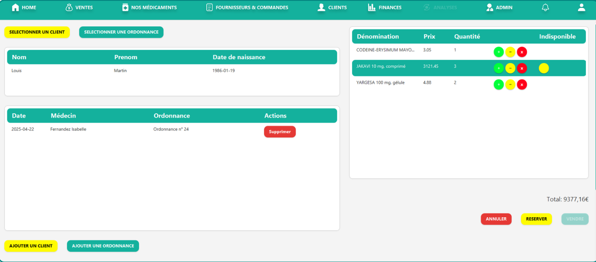
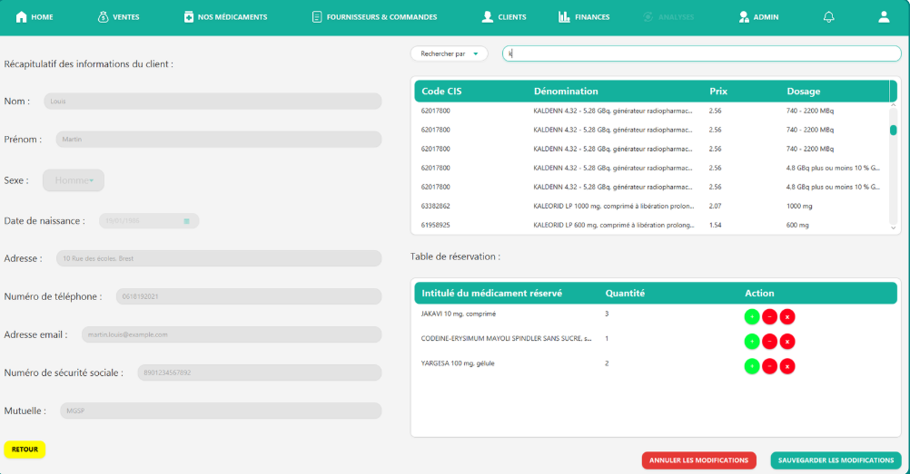
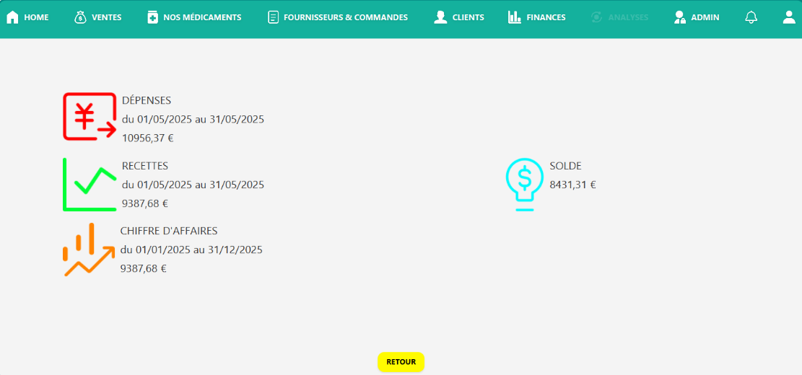

# NextPharm 💊 - ERP de Gestion de Pharmacie

**Next-level control for modern pharmacies.**

NextPharm est un logiciel de gestion intégrée (ERP) professionnel conçu pour automatiser les flux de travail critiques d'une officine. Développé en Java, il offre une solution complète pour la gestion sécurisée des stocks, des ventes réglementées et du suivi patient.

---

## 📌 Présentation du Projet
Réalisé en tant que projet de fin d'étude à l'**Université Paris Cité**, NextPharm répond aux enjeux de modernisation des pharmacies : centralisation des données, traçabilité des ventes d'ordonnances et optimisation de la relation client.

### Points clés :
- **Centralisation** : Gestion unifiée (ventes, achats, clients) sur une seule interface.
- **Conformité Santé** : Module spécifique pour le contrôle et l'archivage des ordonnances.
- **Sécurité Avancée** : Système d'authentification et journalisation de toutes les actions sensibles (Logs).

---

## 🚀 Fonctionnalités Principales

- **🛒 Gestion des Ventes** : 
    - Tunnel de vente avec calcul automatique de la TVA et du prix total.
    - Distinction entre ventes directes et ventes avec prescription médicale.
- **👥 Module CRM (Clientèle)** : 
    - Création et modification de fiches patients détaillées.
    - Historique complet des achats et suivi des ordonnances en cours.
- **📦 Réservations & Stocks** : 
    - Mise de côté de produits pour les clients fidèles.
    - Interface de suivi des stocks en temps réel.
- **📊 Reporting & Finances** : 
    - Visualisation des performances quotidiennes et du chiffre d'affaires.

---

## 🛠 Architecture Technique & Patterns

Le projet a été conçu selon une architecture **MVC (Modèle-Vue-Contrôleur)** rigoureuse pour garantir la maintenabilité du code :

- **Pattern DAO (Data Access Object)** : Isolation complète de la logique d'accès aux données (classes comme `ClientDAO`, `VenteDAO`, `OrdonnanceDAO`).
- **Interfaces JavaFX (FXML)** : Utilisation de fichiers XML pour définir l'UI, stylisés avec du CSS personnalisé.
- **Gestion de la Persistance** : Connexion JDBC optimisée pour interagir avec une base de données MySQL/PostgreSQL.
- **Tests Unitaires** : Mise en place de suites de tests JUnit (ex: `ReservationDAOTest`) pour valider l'intégrité des opérations CRUD.

---

## 📸 Aperçu de l'application

### 📄 Vente avec Ordonnance

### 🛒 Système de Réservation

### 📊 Tableau de bord & Statistiques

---

## 👩‍💻 Ma Contribution (Victoria Massamba)

Au sein de l'équipe, j'ai pris en charge le développement de modules nécessitant une forte interaction entre le Front et le Back :

1.  **Module Client (CRM)** : Conception de l'interface et de la logique métier (`ClientRechercheController`, `ClientModificationController`).
2.  **Moteur de Réservations** : Implémentation complète du système de mise de côté de médicaments (`ReservationAjoutController`, `ReservationDAO`).
3.  **Système de Traçabilité** : Développement du module de Logs (`LogDAO`, `LogController`) permettant d'auditer qui a effectué quelle action sur le logiciel.
4.  **Logique de Vente** : Participation à l'élaboration du tunnel de paiement sécurisé pour les prescriptions.

---

## 🔐 Sécurité & Intégrité
- **Authentification** : Gestion des sessions utilisateurs avec accès restreints.
- **Journalisation** : Chaque vente ou modification de stock est enregistrée dans une table d'audit.
- **Validation** : Vérification stricte des formats de données (emails, numéros de sécurité sociale) via des utilitaires dédiés.

---
*Projet finalisé en 2025 - Présenté à l'Université Paris Cité*
